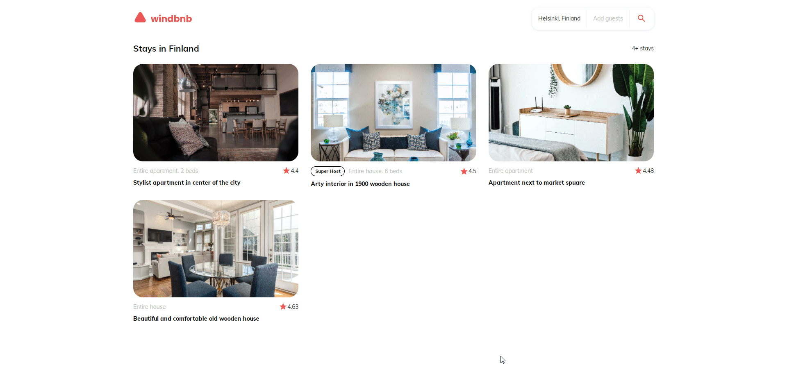

<!-- Please update value in the {}  -->

<h1 align="center">Windbnb</h1>

<div align="center">
   Solution for a challenge from  <a href="http://devchallenges.io" target="_blank">Devchallenges.io</a>.
</div>

<div align="center">
  <h3>
    <a href="https://devchallenges.io/challenges/3JFYedSOZqAxYuOCNmYD">
      Challenge
    </a>
    <span> | </span>
    <a href="https://lucasmercado101.github.io/windbnb-challenge/">
      Solution
    </a>
  </h3>
</div>

<!-- TABLE OF CONTENTS -->

## Table of Contents

- [Overview](#overview)
  - [Built With](#built-with)
- [Features](#features)
- [How to use](#how-to-use)
- [Acknowledgements](#acknowledgements)
- [Contact](#contact)

<!-- OVERVIEW -->

## Overview



### Built With

<!-- This section should list any major frameworks that you built your project using. Here are a few examples.-->

- [Elm](https://elm-lang.org/)
- [Sass](https://sass-lang.com/)

## Features

<!-- List the features of your application or follow the template. Don't share the figma file here :) -->

This was created as a submission to a [DevChallenges](https://devchallenges.io/challenges) challenge. The [challenge](https://devchallenges.io/challenges/3JFYedSOZqAxYuOCNmYD) was to build an application to complete the given `user stories` :

- I can see a list of properties
- I can see the property card with a name, rating, apartment type, and super host
- I can open the filter drawer
- I can filter properties by location and number of guests
- I can see the number of filtered items
- I can see pages following given designs

## How To Use

<!-- Example: -->

To clone and run this application, you'll need [Git](https://git-scm.com) and [Node.js](https://nodejs.org/en/download/) (which comes with [npm](http://npmjs.com)) and [Parcel.js](https://parceljs.org/) installed on your computer.

From your command line:

```bash
# Clone this repository
$ git clone https://github.com/Lucasmercado101/windbnb-challenge

# Run the app
$ parcel index.html index.js styles.sass
```

## Acknowledgements

<!-- This section should list any articles or add-ons/plugins that helps you to complete the project. This is optional but it will help you in the future. For example: -->

- [An Introduction to Elm](https://guide.elm-lang.org/)
- [Elm For Beginners](https://courses.knowthen.com/p/elm-for-beginners)

## Contact

- Website: [lucasmercado101.github.io](https://lucasmercado101.github.io/)
- Email: lucasmercado101@gmail.com
